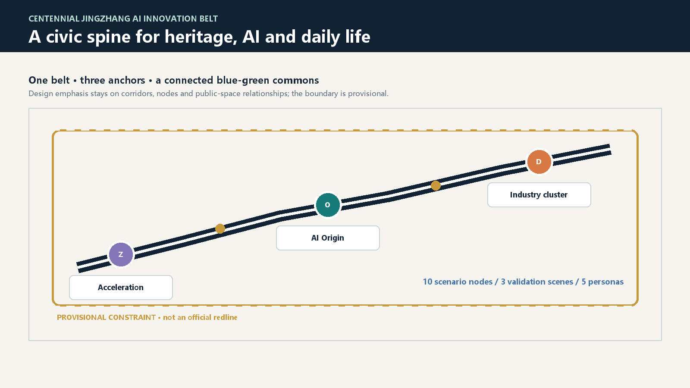
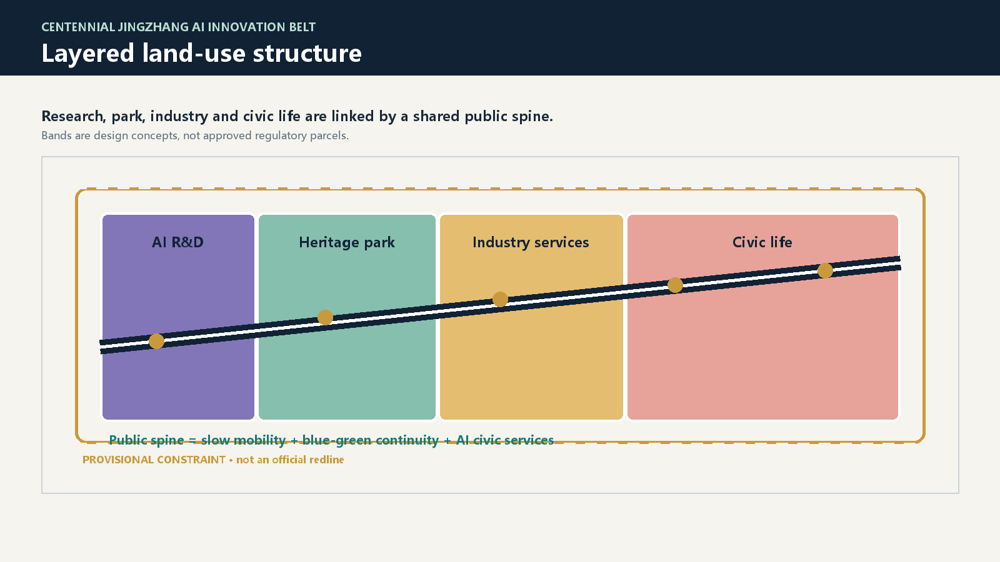
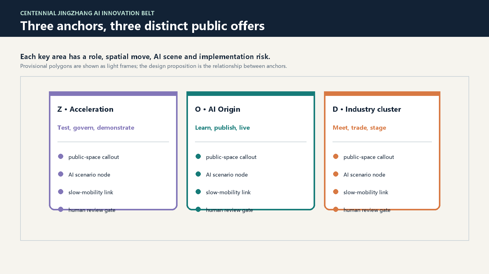
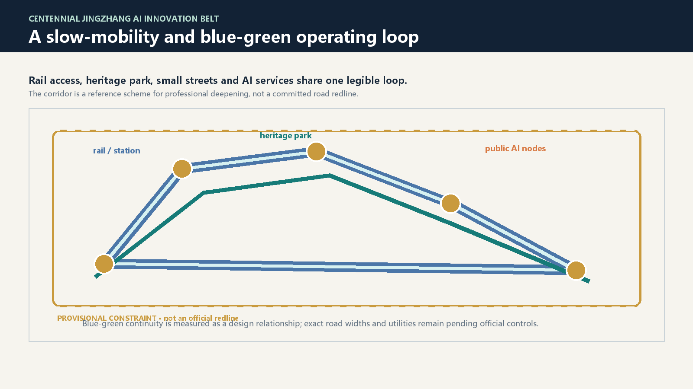
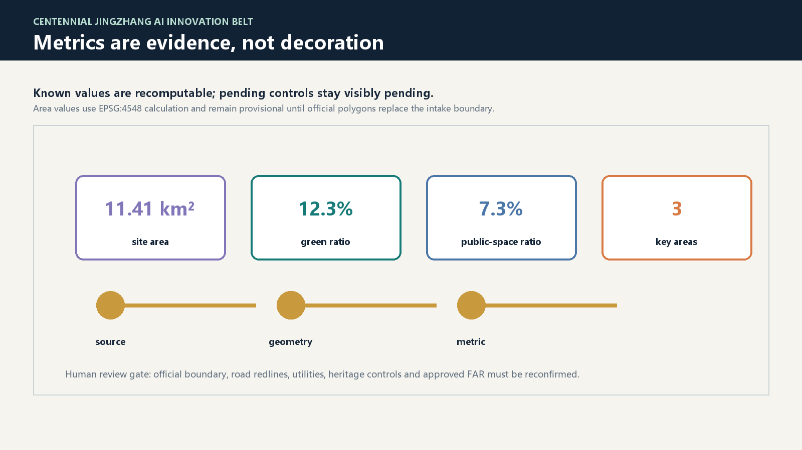

# Jingzhang Commons Weave: A Verifiable AI Civic Spine

This proposal treats the Jingzhang railway heritage as a civic operating system rather than a decorative historical strip. A slow-mobility spine, three anchor districts and a distributed network of public AI scenes form a concept that can be tested, measured and revised by people. All spatial suggestions remain reference schemes for professional teams; they are not statutory planning, approved government action or construction commitments.

## Design Basis and Source List

The package uses the official public announcement and the cleared agent taskbook to frame the three scope levels, the three key areas, the three positioning statements and the six agent requirements [source:OFFICIAL-ANNOUNCEMENT] [source:AGENT-TASKBOOK]. The repository site package supplies schemas, enumerations, professional references and a public source registry [source:SITE-PACKAGE] [source:SOURCE-REGISTRY].

The public qualification material does not include a cleared official polygon for the site or the three key areas. The submitted boundary and key areas therefore use the repository's explicitly provisional geometry [source:BOUNDARY-SOURCE] [source:KEY-AREA-SOURCE]. This is suitable for intake discussion, visual explanation and geometry self-check, but not for an official redline, approved area claim or statutory control. When official data arrives, the boundary, land-use partition, metrics, figures, PDFs and HTML must all be recalculated together.

## Three-Level Scope Framework

The coordinated research area is treated as a regional AI ecosystem: universities, enterprises, public institutions, heritage, rail access and civic services are connected through knowledge exchange and public benefit. The overall design area translates that strategy into a civic spine, blue-green continuity, renewal projects, street interfaces and station-linked services. The key-area scope then tests three distinct spatial offers in enough detail for professional deepening [depth:three_level_scope_framework] [data:geometry/site_boundary.geojson#PROV-SITE-001].

The three levels are intentionally related, not three separate drawing sets. Regional strategy determines what must be accessible; the overall design identifies where public space and service infrastructure can carry that strategy; the key areas test how daily life, industry and AI governance can coexist. The provisional nature of the geometry limits the precision of all area-sensitive conclusions [metric:site_area_sqm].

## Coordinated Research Area: Industry and Future City Research

The coordinated research area is organized around five complementary functions: a full-stack AI innovation system, a world-class innovation ecosystem, AI-enabled scene prototyping, an intelligent and lively city, and a platform for global AI governance dialogue [source:AGENT-TASKBOOK]. The proposal names the public identity “Jingzhang Commons Weave”, with a visual language of a rail line, a woven loop and three civic nodes. The mark is a conceptual direction: a dark blue line crosses three colored circles, while gold stitches represent open evidence and human review.

Eight ecosystem cases become spatial programs rather than slogans: model testing and safety governance; university-to-market translation; open-source release; low-carbon computing; data-element literacy; AI-enabled health navigation; accessible education services; and international developer exchange. Each case can occupy a room, courtyard, station interface, public-space kiosk or event route. Their performance should be judged by participation, privacy, access and public value, not by branding alone [depth:overall_spatial_structure].

The cultural narrative joins three histories: Jingzhang as an infrastructure of movement, Zhongguancun as a culture of experimentation, and AI as a new culture of shared tools and accountable intelligence. The long-term brand should be carried by open documentation, recurring public demonstrations and a visible record of what was learned, not by an unverified claim of official endorsement.

## Overall Design Area: Urban Renewal and Regulatory-Plan-Level Urban Design

The overall design proposal is a four-part spatial structure: an AI research and testing band, the Jingzhang heritage park and blue-green public space, an industry-service and civic production band, and a daily-life interface band [data:geometry/land_use.geojson#LU-001] [depth:overall_spatial_structure]. A continuous public spine crosses these bands and turns the heritage park into a shared address for learning, working, meeting and resting.

The spatial move is deliberately modest: preserve and adapt where possible, concentrate new civic services at existing movement and public-space interfaces, and use temporary or reversible installations to test AI scenes before permanent investment. Building scale, parcel-level retention and demolition, road redlines, utility capacity, heritage controls and approved FAR remain pending official controls [standard:MOHURD-CONTROL-DETAILED-PLANNING]. No inferred number is presented as an approved planning indicator.

The package's known evidence layer records 11.41 km² of provisional submitted area, a 12.3% green ratio and a 7.3% public-space ratio; these are recomputable from the package geometry but must be recalculated when official polygons replace the intake boundary [metric:green_ratio] [metric:public_space_ratio].

## Detailed Design of Key Areas

The northern Zhongzhiyuan AI Acceleration Area is a garden-like full-stack innovation district. Its design direction is a chain of test rooms, governance workshops, demonstration edges and low-carbon public-space experiments linked to the slow-mobility spine. The Beijing AI Origin Community is a near-campus translation district: an open release hall, student and resident services, adaptable retained buildings, and a daily route between campus, neighborhood and rail access. The southern Dazhongsi AI Industry Cluster is an urban industry-service district: station-facing meeting rooms, data-element literacy, international exchange and a more legible pedestrian interface [data:geometry/key_areas.geojson#PROV-KEY-001] [data:geometry/key_areas.geojson#PROV-KEY-002] [data:geometry/key_areas.geojson#PROV-KEY-003].

Each key area has the same review frame—position, spatial structure, building renewal logic, walking and public-space network, AI scenes and implementation risk—but a different public offer. The northern area tests and governs; the middle area learns and publishes; the southern area meets and translates. Provisional polygons are reference envelopes only, so all detailed conclusions require professional and official-data confirmation [depth:three_key_area_detailed_design].

## AI Innovation Ecosystem, Personas, and AI+ Scenarios

The five core personas are an open-source developer, a start-up team, an enterprise visitor, a nearby resident, and a university student or teacher. Their needs are different: release and collaboration, affordable testing, exchange and recruitment, everyday mobility and services, or translation between research and practice. The public realm should support all five without collecting unnecessary personal traces.

The package develops ten scenario cards: an open release hall; an AI safety sandbox; an edge-computing service station; an explainable walking navigator; an international Dazhongsi demo salon; a low-carbon Qinghe innovation yard; a university-to-market translation route; a data-element learning theater; an AI daily-service pattern library; and a global AI event loop. At least three are industry test and validation scenes: the safety sandbox, the edge-computing station and the data-element theater. Each card requires an explicit data source, privacy boundary, human review gate, operating actor and public-space location [data:geometry/public_space.geojson#PUBLIC-001] [data:geometry/roads.geojson#ROAD-001].

The proposal distinguishes AI assistance from automated authority. Agents may identify walking gaps, summarize service demand or support event safety review, but they may not approve plans, infer private identities or claim government implementation. This is the spatial expression of human-centered governance [source:AGENT-TASKBOOK].

## Land Use, Building Scale, and Retain-Renovate-Demolish Strategy

The land-use partition is a design evidence layer, not a substitute for statutory land-use control. It separates AI research, heritage and public green space, industry services and civic life while maintaining a shared public spine [data:geometry/land_use.geojson#LU-001]. Buildings are grouped by a conservative retain–renovate–new-build logic: retain structures with cultural or everyday value; renovate for accessibility, shared services and flexible work; and reserve new-build capacity for clearly justified civic or infrastructure needs [data:geometry/buildings.geojson#BLDG-001].

The proposal avoids parcel-level demolition claims. Exact building heights, floor-area ratios, development intensity, setbacks and ownership conditions are unknown until official planning and survey material is provided [standard:MOHURD-ARCH-DESIGN-DEPTH-2016]. New construction is therefore described as a professional option to test, not as a commitment. Any future massing should preserve the legibility of the heritage spine, keep active ground floors on public routes and protect accessible everyday services.

## Transport, Rail, Municipal Infrastructure, and Public Services

The transport concept is a rail-and-walking loop: station interfaces feed the heritage park, neighborhood streets, three key areas and AI public-service nodes [data:geometry/roads.geojson#ROAD-001]. Priority is given to continuous walking, safe crossings, bicycle parking, non-motorized access, accessible wayfinding and small-scale service stops. A reversible pilot can test the route before a full engineering design.

Municipal and digital infrastructure should be layered rather than hidden: distributed energy, water-sensitive public space, edge computing, maintenance access and conventional city services share an auditable operating plan. The package does not assert pipe capacity, fire access, road width, rail engineering or energy performance because those official conditions are not in the public site package. They are explicit human-review gates for the next phase [depth:municipal_new_infrastructure].

## Blue-Green Network, Public Space, and Urban Character

The Jingzhang heritage park is the memory line of the proposal; the blue-green network is its everyday public life. A loop of shaded walking, rainwater-sensitive edges, small civic rooms, outdoor learning and low-carbon demonstrations links the park to neighborhood and industry interfaces [data:geometry/green_space.geojson#GREEN-001] [data:geometry/public_space.geojson#PUBLIC-001]. The public-space ratio is recorded as a known, recomputable package metric rather than a visual promise [metric:public_space_ratio].

Three conceptual AI pilgrimage or honor-display landmarks complete the narrative: the Origin Gate at the middle community, the Open Model Garden in the northern acceleration area, and the Commons Exchange at Dazhongsi. They are not monuments to a single company. They are public rooms for memory, open methods, safety review and community celebration, connected to the heritage park, Zhongguancun culture and a distributed civic network.

## Renewal Projects, Implementation Policy, and Phasing

The near-term phase is reversible and public-facing: mark the slow-mobility spine, open a small release hall, run walking and accessibility audits, and test three industry scenes. The middle phase improves station interfaces, retained-building accessibility, public-space continuity and shared service rooms. The long-term phase can deepen the three anchor districts, expand international events and integrate confirmed municipal and regulatory conditions.

Implementation is proposed as a learning contract: every project records an owner, public benefit, data boundary, human review gate, maintenance responsibility, phasing dependency and stop condition. Candidate projects include the heritage walking loop, open release hall, safety sandbox, low-carbon computing yard, university translation route, Dazhongsi exchange salon and global event route [data:geometry/phasing.geojson#PHASE-001]. Funding, procurement, policy, investment and operations remain concept directions for professional and public review, not confirmed government arrangements.

## Metrics, Area Recalculation, and Compliance Matrix

The evidence chain is organized from source to geometry to metric to review. Known values include the provisional site area, green ratio, public-space ratio and a count of three key areas [metric:site_area_sqm] [metric:key_area_count]. The package also records the pending FAR and other official controls as unknown with reasons and recalculation triggers. The structured matrices cover announcement tasks, six agent tasks, professional standards and design depth; the narrative explains their consequences rather than dumping identifiers [standard:MOHURD-URBAN-DESIGN-MEASURES] [depth:metrics_recalculation].

The official polygon replacement procedure is deterministic: replace site and key-area geometry, rebuild the topology-safe land-use partition, regenerate buildings, roads, green space, public space and phasing, recalculate areas in EPSG:4548, regenerate figures and HTML, then rerun finalization and self-check. A changed number without changed geometry is not accepted as evidence.

## Risk, Copyright, and Compliance

The main risks are boundary uncertainty, missing planning and infrastructure controls, privacy in public AI scenes, operating cost, unequal access and premature claims of implementation. The package therefore labels provisional geometry, keeps human review in every high-impact scenario, uses public or cleared source records, and keeps official claims separate from design suggestions [source:SOURCE-REGISTRY].

Visual assets are participant-authored diagrams generated with Pillow and locally installed fonts; the package does not embed remote images, remote fonts, map tiles, CDN scripts, trackers or private data. The drawings and HTML are presentation layers; GeoJSON, metrics and matrices remain authoritative. All concepts should be reviewed by qualified planning, transport, municipal, heritage, accessibility, legal and community practitioners before any implementation decision.

## References

The evidence base is the repository site package, its public source registry, the official public announcement, the cleared agent taskbook, the provisional geometry record and the local professional reference snapshots [source:SITE-PACKAGE] [source:OFFICIAL-ANNOUNCEMENT] [source:AGENT-TASKBOOK]. The central limitations are visible in `assumptions.json`, `sources.json`, `self_check.json` and the package's provisional-boundary note. This submission is an open, reviewable proposal and not an official plan.
